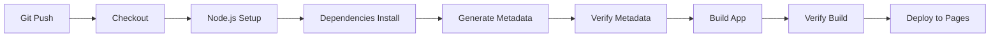

# 배포 자동화 가이드

## 📋 개요

GitHub Actions를 통해 `_posts/` 폴더의 마크다운 파일을 기반으로 자동으로 메타데이터를 생성하고 배포합니다.

---

## 🔄 자동화 프로세스

### 1. 트리거 조건

- **자동 배포**: `main` 브랜치에 `push` 시
- **수동 배포**: GitHub Actions 탭에서 "Run workflow" 클릭

### 2. 배포 단계



#### 상세 단계:

1. **Checkout Repository** ✅
   - 전체 코드와 `_posts/` 폴더를 가져옵니다

2. **Setup Node.js** ✅
   - Node.js 20 버전을 설정합니다

3. **Install Dependencies** ✅
   - 필요한 npm 패키지들을 설치합니다

4. **Generate Metadata from _posts** ✅ (핵심)
   ```bash
   npm run build:posts
   ```
   - `_posts/*.md` 읽기
   - Front Matter 파싱
   - `public/data/posts-meta.json` 생성
   - `public/data/categories.json` 생성

5. **Verify Generated Metadata** ✅
   - 파일 생성 확인
   - 포스트 개수 확인
   - 카테고리 목록 확인

6. **Build Application** ✅
   ```bash
   npm run build
   ```
   - Vite 빌드 실행
   - `dist/` 폴더 생성
   - `dist/_posts/` 복사
   - `dist/data/` 메타데이터 복사

7. **Verify Build Output** ✅
   - `dist/` 구조 확인
   - 데이터 파일 확인
   - 마크다운 파일 확인

8. **Deploy to GitHub Pages** ✅
   - `dist/` 폴더를 GitHub Pages에 배포

---

## 📝 포스트 작성 및 배포 워크플로우

### 로컬에서 작성

```bash
# 1. 새 포스트 작성
vi _posts/2025-10-13-new-post.md

# 2. 로컬에서 테스트
npm run dev

# 3. 빌드 테스트
npm run build:posts
npm run build

# 4. Git 커밋 & 푸시
git add _posts/2025-10-13-new-post.md
git commit -m "post: 새 포스트 추가"
git push origin main
```

### GitHub Actions 자동 실행

```
push 감지
  ↓
자동으로 빌드 스크립트 실행
  ↓
_posts/ 읽기
  ↓
posts-meta.json 생성 ✅
categories.json 생성 ✅
  ↓
앱 빌드 & 배포 ✅
```

---

## 🔍 메타데이터 생성 과정

### posts-meta.json

```javascript
// scripts/build-posts.js가 실행됨
_posts/*.md 파일 읽기
  ↓
각 파일의 Front Matter 파싱
  ↓
메타데이터 추출 (title, date, category, tags, etc.)
  ↓
날짜순 정렬 (최신순)
  ↓
public/data/posts-meta.json 저장
```

**생성되는 데이터:**
```json
[
  {
    "id": "2025-10-09-java-step1",
    "slug": "2025-10-09-java-step1",
    "filename": "2025-10-09-java-step1.md",
    "title": "Java 기초 다지기",
    "date": "2025-10-09",
    "category": "Language",
    "subcategory": "Java",
    "tags": ["Java", "기초"],
    "excerpt": "...",
    "author": "Geon Lee"
  }
]
```

### categories.json

```javascript
posts-meta.json 분석
  ↓
카테고리별 통계 계산
  ↓
서브카테고리 그룹핑
  ↓
CATEGORY_CONFIG와 병합
  ↓
public/data/categories.json 저장
```

**생성되는 데이터:**
```json
[
  {
    "id": "Language",
    "name": "Programming Language",
    "icon": "📝",
    "description": "프로그래밍 언어",
    "count": 4,
    "subcategories": [
      {
        "id": "Java",
        "name": "Java",
        "count": 2
      }
    ]
  }
]
```

---

## 🛠️ 배포 로그 확인

### GitHub Actions 로그 예시

```
📝 Generating posts-meta.json and categories.json from _posts/...
✅ Built 13 post(s)
📁 Posts metadata: /path/to/posts-meta.json
📁 Markdown files: /path/to/_posts

📊 Building categories...
✅ Built categories
   💻 Computer Science: 2 posts
      └─ Algorithm: 1 posts
      └─ Structure: 1 posts
   📝 Programming Language: 4 posts
      └─ Java: 2 posts
   ...
✅ Metadata generation complete

🔍 Verifying generated files...
📁 posts-meta.json: 50K
📁 categories.json: 2.5K
📊 Posts count: 13
📊 Categories: ["Computer Science", "Programming Language", ...]
✅ Metadata verification complete

🏗️  Building application...
vite v6.3.5 building for production...
✓ built in 1.20s
✅ Copied _posts to dist/_posts
✅ Build complete
```

---

## 🔧 문제 해결

### 메타데이터가 생성되지 않는 경우

**증상:**
```
Error: posts-meta.json not found
```

**원인:**
1. `_posts/` 폴더에 마크다운 파일이 없음
2. Front Matter 형식 오류
3. 빌드 스크립트 실행 실패

**해결:**
```bash
# 로컬에서 테스트
npm run build:posts

# 오류 확인
cat _posts/2025-10-13-new-post.md

# Front Matter 형식 확인
---
title: "제목"
date: "2025-10-13"
category: "Language"
---
```

### 카테고리가 표시되지 않는 경우

**원인:**
- `category` 값이 `CATEGORY_CONFIG`의 `id`와 불일치

**해결:**
```javascript
// scripts/build-posts.js 확인
const CATEGORY_CONFIG = [
  { id: 'Language', name: '...', ... },
  // ...
];

// Front Matter에서도 정확히 일치해야 함
category: "Language"  // ✅ 대소문자 정확히
```

---

## 📊 배포 상태 확인

### GitHub Actions 탭
1. GitHub 저장소 접속
2. "Actions" 탭 클릭
3. 최신 워크플로우 실행 확인
4. 각 단계별 로그 확인

### 배포된 사이트 확인
```
https://krongdev.github.io
```

### API 엔드포인트 확인
```bash
# 메타데이터 확인
curl https://krongdev.github.io/data/posts-meta.json

# 카테고리 확인
curl https://krongdev.github.io/data/categories.json
```

---

## ✅ 체크리스트

### 포스트 작성 전
- [ ] `_posts/` 폴더 존재 확인
- [ ] 파일명 형식: `YYYY-MM-DD-slug.md`

### 포스트 작성 시
- [ ] Front Matter 정확히 작성
- [ ] `category` 값 `CATEGORY_CONFIG`와 일치
- [ ] 필수 필드 포함 (title, date, category, excerpt)

### 배포 전
- [ ] 로컬에서 빌드 테스트: `npm run build:posts`
- [ ] 로컬에서 앱 테스트: `npm run dev`
- [ ] Git 커밋 메시지 작성

### 배포 후
- [ ] GitHub Actions 로그 확인
- [ ] 배포된 사이트 확인
- [ ] 메타데이터 API 확인

---

## 🚀 고급 설정

### 특정 경로만 배포 트리거

```yaml
on:
  push:
    branches: ['main']
    paths:
      - '_posts/**'
      - 'src/**'
      - 'public/**'
```

### 배포 알림 추가

```yaml
- name: Notify deployment
  if: success()
  run: |
    echo "✅ Deployment successful!"
    # Slack, Discord 등 웹훅 가능
```

### 캐시 활용

```yaml
- name: Cache node modules
  uses: actions/cache@v3
  with:
    path: node_modules
    key: ${{ runner.os }}-node-${{ hashFiles('package-lock.json') }}
```

---

## 📖 요약

### 핵심 포인트

1. **자동화**: `_posts/` 폴더만 관리하면 됨
2. **메타데이터**: Git push 시 자동 생성
3. **검증**: 각 단계마다 검증 로직 포함
4. **투명성**: 상세한 로그로 문제 추적 용이

### 데이터 흐름

```
_posts/*.md (Git 관리)
    ↓
npm run build:posts (자동 실행)
    ↓
posts-meta.json + categories.json (자동 생성)
    ↓
npm run build (앱 빌드)
    ↓
dist/ (배포)
```

### 관리 포인트

✅ **관리 필요**: `_posts/*.md`  
❌ **관리 불필요**: `posts-meta.json`, `categories.json`  
🤖 **자동 생성**: GitHub Actions가 처리

---

**이제 `_posts/` 폴더에 마크다운 파일만 추가하면 자동으로 배포됩니다!** 🎉

